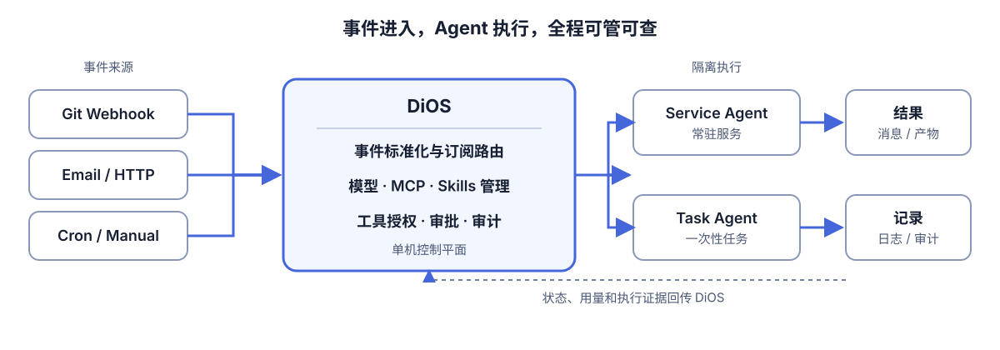
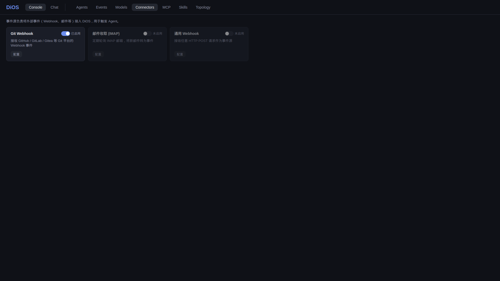
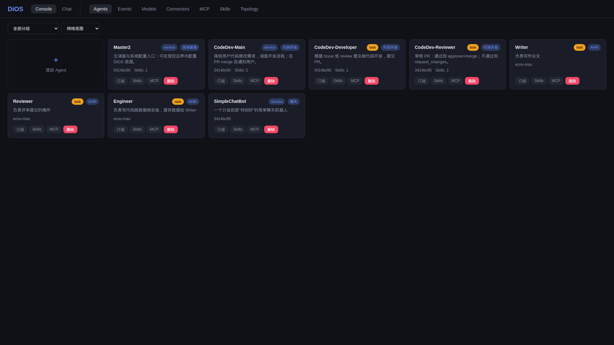

# DiOS

> 单机部署的事件驱动 Agent 控制平面：接入事件、调度 Agent、管理资源，并记录每次执行。

DiOS 管理 Agent，Agent 完成工作。它基于 [DiAgent](https://github.com/HQIT/DiAgent)，把 Git、邮件、Webhook 或定时任务路由给合适的 Agent，在隔离容器中执行。

<p align="center">
  
</p>

## 能做什么

| 接入与路由 | 执行与治理 |
| --- | --- |
| GitHub / GitLab / Gitea Webhook、IMAP、HTTP、Cron | service 常驻 Agent 与 task 一次性 Agent |
| CloudEvents 标准化、订阅规则、条件匹配与去重 | LLM、MCP、Skills、工具授权、审批、日志与审计 |

## 界面

<table>
  <tr>
    <td width="50%"></td>
    <td width="50%"></td>
  </tr>
  <tr>
    <td align="center">统一管理事件来源</td>
    <td align="center">配置与查看 Agent</td>
  </tr>
</table>

## 快速启动

需要 Docker 和 Docker Compose：

```bash
git clone --recurse-submodules https://github.com/HQIT/DiOS.git
cd DiOS
docker compose up -d
```

打开 `http://localhost:3000`。API 默认位于 `http://localhost:8000`。

CLI 与 Console 使用同一组控制面 API：

```bash
python cli/dios registry mcp github
python cli/dios registry skills mcp
python cli/dios registry plugins
python cli/dios connector types
```

进一步了解：[Roadmap](ROADMAP.md) · [架构说明](docs/architecture.md) · [Connector 契约](docs/adr/0001-connector-plugin-contract.md)

## 项目边界

DiOS 负责事件、资源、调度和治理；DiAgent 负责单个 Agent 的推理与工具调用。当前路线以单机、单实例和可信操作者为边界，多租户与集群化暂缓。

## License

MIT
