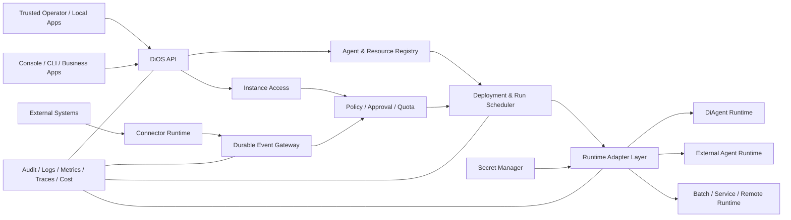

# DiOS Roadmap：从多 Agent 原型到可靠的单机 Agent OS

> 状态：讨论稿
>
> 更新日期：2026-09-07（Phase 0 进行中：Connector 契约与注册表已落地，见 [ADR 0001](docs/adr/0001-connector-plugin-contract.md)）
>
> 适用范围：DiOS、DiAgent 及其 App、Connector 和 Runtime 生态
>
> 当前阶段约束：以单机、单实例、单一可信操作者为部署边界；暂不建设多租户、组织隔离和多集群能力

## 1. 愿景

DiOS 的目标不是成为另一个个人 AI 助手，也不是把聊天、记忆、人格和渠道能力全部集中到一个应用中。

DiOS 当前要成为可靠的单机 Agent 控制平面：统一注册、部署、连接、授权、调度、观察和审计不同类型的 Agent Runtime，使一台主机能够安全、稳定、可恢复地运行一批智能体工作负载。

一句话定位：

> DiOS 管理 Agent，Agent 完成工作。

当前目标是让操作者能够回答以下问题：

- 谁创建、发布和调用了哪个 Agent？
- Agent 运行在哪个环境，使用了哪些模型、工具、数据和凭据？
- 一次执行为什么发生，经过了哪些审批，产生了什么结果？
- Agent 是否遵守实例策略、预算、数据边界和安全要求？
- 当模型、Prompt、Skill、Connector 或 Runtime 变化后，能否审计、回滚和复现？

## 2. 产品边界

### 2.1 DiOS 负责

- 单机实例配置、访问控制与凭据管理
- Agent 定义、版本、部署和运行生命周期
- LLM、MCP、Skill、Connector、Secret 等资源注册与分配
- 事件接入、标准化、订阅、可靠投递和执行追踪
- Policy、Approval、Quota、Budget 与合规治理
- 日志、指标、Trace、审计与成本分析
- Runtime、Connector 和 Provider 的扩展机制
- 面向 Console、CLI、CI/CD 和业务 App 的稳定 API

### 2.2 DiAgent 负责

- 单个 Agent 的推理循环与工具调用
- Prompt、上下文、短期记忆和任务执行
- 与模型、MCP、Skill 的运行时交互
- 按 DiOS 下发的身份、权限和资源边界执行任务
- 上报结构化状态、事件、用量和结果

### 2.3 App 负责

- 面向具体用户场景的交互体验
- Chat、Console、CLI、Slack Bot、审批台等应用形态
- App 自己的会话、页面和业务展示逻辑
- 通过 `/api/os/*` 使用 DiOS 能力，而不是把业务逻辑写入 OS 核心

### 2.4 Connector 负责

- 对接一个明确的外部系统或协议
- 管理该类型专属的配置校验、鉴权、连接和健康检查
- 将外部输入标准化为平台事件，或将平台输出投递到外部系统
- 独立测试、独立版本演进，不在通用服务中硬编码类型判断

### 2.5 暂不负责

- Organization、Tenant、Project 隔离、SSO 和跨租户 RBAC
- 多节点高可用、Kubernetes 和多集群调度
- 与个人助手产品竞争聊天体验、人格和长期个人记忆
- 重新实现通用大模型推理框架
- 在 OS 核心中承载客户专属业务流程
- 一开始就自研完整工作流 DSL；可先与 Temporal、Argo、n8n 等系统集成
- 以增加渠道、Prompt 模板或 Demo 数量作为产品进展指标

## 3. 判断一项功能是否属于 DiOS

如果一项功能只让一个 Agent 更聪明、更好聊，应优先放入 DiAgent 或 App。

如果一项功能让一批 Agent 更安全、更可控、更可靠、更容易运营，才应进入 DiOS。

进入 OS 核心前至少回答：

1. 它是否服务于多个 Agent 或 Runtime？
2. 它是否涉及生命周期、资源、权限、策略、可靠性或可观测性？
3. 它能否通过稳定契约实现，而不是依赖某个 Agent 框架？
4. 它是否会形成新的类型硬编码？
5. 它的行为能否审计、测试和兼容升级？

## 4. 当前基础与主要缺口

### 4.1 已有基础

- Agent CRUD 与 service/task 两种运行模式
- 基于容器的 Agent 运行隔离
- LLM、MCP、Skill 等资源管理雏形
- Connector、CloudEvents、订阅与事件路由
- 事件日志、重试、去重和 A2A Task 雏形
- `/api/os/*` 与 `/api/apps/*` 的初步分层
- Console App 与 Chat App

### 4.2 单机阶段关键缺口

- 缺少稳定的实例访问令牌、Secret 引用和凭据轮换机制
- Agent 配置尚未形成不可变 Revision 与可回滚 Deployment
- SQLite、Docker 和本地文件的迁移、备份、恢复流程尚未固化
- Connector 和 Runtime 仍存在类型硬编码，缺少插件契约（Connector 契约与注册表已落地，API 与 Console 尚未接线，见 ADR 0001）
- 缺少统一 Policy、Approval、Quota 和 Budget
- 缺少端到端 Trace、结构化审计和成本归因
- 缺少持久队列、并发控制、重启恢复和可验证升级策略

## 5. 目标架构



架构必须区分两条链路：

- 控制面：定义、授权、发布、调度、策略和审计
- 数据面：事件、消息、模型请求、工具调用和执行结果

控制面故障不应导致已运行工作负载立即失控；数据面不能绕过控制面的身份和策略。

## 6. 核心领域模型

### 6.1 实例与访问

- Instance：一套单机 DiOS 部署及其稳定身份
- Operator：本机可信操作者
- ApiToken：Console、CLI、App 调用实例 API 的可吊销凭据
- SecretReference：Agent、Connector 和 MCP 使用的凭据引用

### 6.2 Agent 生命周期

- AgentDefinition：逻辑 Agent 及其稳定身份
- AgentRevision：不可变版本，包含 Prompt、模型、Skill、MCP 和运行参数引用
- AgentDeployment：某 Revision 在特定环境中的期望状态
- AgentRuntime：实际运行实例
- AgentRun：一次可追踪、可取消、可重试的执行
- Artifact：执行输出及其来源信息

### 6.3 平台资源

- ModelProvider / ModelEndpoint
- MCPServer / SkillPackage
- ConnectorDefinition / ConnectorInstance
- RuntimeDefinition / RuntimePool
- SecretReference
- Policy / ApprovalRequest
- Quota / Budget

所有可执行对象必须带有明确的创建来源、配置版本和实例内唯一标识；数据模型应保留未来增加作用域字段的迁移空间，但当前不实现租户语义。

## 7. 扩展机制

### 7.1 Connector 目录与契约

内建 Connector 与第三方 Connector 使用同一注册机制：

```text
backend/app/connectors/
├── contracts/
├── registry.py
├── runtime.py
└── builtin/
    ├── generic_webhook/
    ├── git_webhook/
    └── imap/
```

每个 Connector 独立拥有：

- manifest 与类型标识
- 配置 Schema 与敏感字段声明
- 输入、输出及生命周期能力声明
- 健康检查与连接测试
- 事件映射和错误分类
- 单元测试与兼容性测试

公共契约采用能力模型，不能要求所有 Connector 都实现 `poll()`。Webhook、轮询、流式订阅和输出投递应是不同的可选能力。

入站与出站的职责必须分开：入站由 Connector 承担，出站由 MCP 承担。Connector 的输出投递能力保留在契约中，但在 MCP 边界稳定前不实现，避免两条链路重复建设。

事件类型和 source namespace 同样不得在 OS 核心枚举。由 Agent 自行发布的场景事件通过声明数据注册，删除声明即卸载场景，OS 核心不感知其语义。

### 7.2 Runtime Adapter

DiAgent 是首选 Runtime，但不是 DiOS 唯一可管理的 Runtime。Runtime Adapter 至少定义：

- deploy / start / stop / delete
- run / cancel / retry
- health / status
- logs / metrics / usage
- secret、workspace、network 和 policy 注入

当前阶段 Adapter：

- Local Docker

Remote DiAgent 与 Kubernetes Job / Deployment 延后到单机阶段完成后评估。

## 8. 分阶段路线图

时间范围是建议顺序，不是发布日期承诺。每一阶段必须通过退出门槛后再进入下一阶段。

### Phase 0：定位冻结与架构清理（0—6 周）

目标：阻止产品继续向个人助手和类型硬编码漂移。

交付：

- 确认本文档中的产品边界与术语
- 建立架构决策记录 ADR 机制
- 明确 DiOS、DiAgent、App、Connector 的仓库职责
- 将 Chat 定位为参考 App，而不是 OS 核心
- 建立 Connector 和 Runtime Adapter 契约
- 事件类型与 source namespace 注册化，业务场景事件迁出 OS 核心
- 整理模块依赖，禁止 OS 核心引用具体 App
- 建立数据库迁移、API 版本和兼容策略
- 给现有功能补齐最小架构测试和回归基线

退出门槛：

- 新增 Connector 不需要修改通用路由中的类型白名单或条件分支
- 新增 App 不修改 OS 核心服务
- 核心领域术语在 API、数据库和文档中一致
- 主分支具备可重复的最小端到端测试

### Phase 1：单机闭环与可恢复运行（1—3 个月）

目标：把现有功能收敛为可安装、可升级、可恢复的单机产品基线。

交付：

- 完成 Connector 注册表到 API、事件目录和 Console 动态表单的接线
- 定义 Local Docker Runtime Adapter，统一 service 与 task 状态机
- 建立正式数据库 Migration，并提供 SQLite、配置和 workspace 的备份恢复命令
- AgentDefinition、AgentRevision、AgentDeployment、AgentRun 最小模型
- 不可变 Revision、变更历史和本机回滚
- 持久任务队列、租约、心跳、幂等键、重试和明确终态
- API Token 哈希存储、吊销与过期；Secret 不再通过普通响应返回
- 单机安装、升级、卸载和故障恢复文档

退出门槛：

- 一台新主机可按文档完成安装，并通过最小端到端测试
- DiOS 或 Worker 重启不会丢失已提交的 Run
- Agent 异常退出后任务能够安全恢复或进入明确终态
- 任意 Deployment 可以在本机回滚到已知 Revision
- 备份可在干净实例上恢复，并保留配置、运行记录和必要产物

### Phase 2：单机治理与可观测性（3—6 个月）

目标：让操作者能够限制 Agent 的行为，并解释每一次执行。

交付：

- 实例级 Policy 与高风险操作 Approval Gate
- Model、Tool、Connector、Network 和 Workspace 策略
- Token、请求量、并发、运行时长和金额预算
- 结构化 AuditEvent、日志、指标和统一 Correlation ID
- Run、模型调用、工具调用和外部投递的端到端关联
- Agent、模型和 Connector 维度的用量与成本归因
- Artifact 与输入输出来源记录
- 健康检查、诊断包和有界日志导出

退出门槛：

- 未授权 Agent 无法访问被禁止的模型、工具、网络或 Secret
- 高风险动作在批准前不能执行
- 一次 Run 能够追踪到事件、配置版本、Runtime、模型、工具和输出
- 配额与预算在本机并发场景下可靠执行

### Phase 3：单机扩展生态与交付质量（6—9 个月）

目标：在不引入多租户和集群复杂度的前提下，降低扩展与运维成本。

交付：

- Connector、Runtime、Skill、Policy Package 的版本、签名和准入检查
- Connector 与 Runtime SDK、契约测试套件和示例实现
- GitOps / CI/CD 发布集成
- 稳定的 API 版本、兼容窗口和升级检查
- 单机容量规划、资源上限和压力测试
- SLO、运维手册、故障注入和恢复演练

退出门槛：

- 扩展包具备来源、版本、签名、权限声明和回滚能力
- 新增 Connector 或 Runtime 不需要修改 OS 核心类型分支
- 连续升级与回滚演练不丢失关键数据
- 单机容量边界和降级行为有可重复测试结果

### 延后范围：多租户与集群化

Organization、Project、Environment、SSO、跨租户 RBAC、PostgreSQL 集群、高可用控制面、Kubernetes Runtime Pool 和多集群调度不进入当前三阶段。只有在单机退出门槛稳定通过、并出现明确部署需求后，才通过新 ADR 重新排期；当前代码只保留可迁移性，不提前实现这些语义。

## 9. 横向工作流

以下工作不应被推迟到最后：

### 安全

- 默认拒绝和最小权限
- Secret 不进入日志、Prompt、普通配置和 API 响应
- 防止 Prompt Injection 绕过工具、网络和数据策略
- 镜像、依赖和扩展包供应链安全
- 实例 API、Agent Runtime 与宿主机之间的权限边界测试

### 兼容性

- 稳定的 API 版本策略
- 数据库 Schema Migration
- Connector、Runtime、Event Schema 版本
- 弃用周期与升级说明

### 可靠性

- 明确 Run 和 Event 状态机
- 所有异步投递具备幂等与重放策略
- 超时、取消、重试和部分失败具有一致语义
- 故障注入和恢复测试

### 开发者体验

- 本地开发环境一键启动
- Connector 与 Runtime SDK
- 契约测试套件和示例实现
- OpenAPI、CLI 与可复制的部署文档

## 10. 北极星指标

不以 Agent 数量、Channel 数量或 Demo 数量衡量产品进展。

建议指标：

- Run 成功率及按错误类别划分的失败率
- 事件接收到 Run 启动的 P50/P95/P99 延迟
- 控制面可用性和任务恢复时间
- 可被完整追踪和复现的 Run 比例
- 受实例访问控制、Policy 和 Budget 覆盖的资源比例
- 未授权访问与 Runtime 越权测试通过率
- 单 Agent、模型和 Connector 的成本可归因率
- Deployment 回滚成功率和平均恢复时间
- Connector/Runtime 新实现对核心代码的修改量

## 11. 建议的首批 Issues

1. 接受单机 Agent OS 阶段边界并更新架构文档
2. 建立 ADR 模板和架构所有者机制
3. 完成 Connector Registry 到 API、事件目录和 Console 的接线
4. 定义 AgentDefinition、Revision、Deployment、Run 状态机
5. 定义 Local Docker Runtime Adapter 并封装现有运行逻辑
6. 引入正式数据库 Migration 与 SQLite 备份恢复流程
7. 实现持久队列、重启恢复、并发限制、幂等与重试
8. 完善 API Token 生命周期和 SecretReference
9. 定义 AuditEvent Schema 和全链路 Correlation ID
10. 建立最小端到端单机安装、运行、升级和恢复测试
11. 从 E2AG 分支提取任务级工具授权、审批生命周期及其测试
12. 恢复主分支镜像构建，并建立合并前必过检查

这些 Issues 应优先形成契约、测试和迁移方案，再开始大规模实现。

## 12. Roadmap 治理

- 本 Roadmap 每月审阅一次，每季度调整阶段目标
- 所有重大架构改变通过 ADR 记录背景、选择和后果
- 每个阶段必须有负责人、验收条件和迁移计划
- 未达到上一阶段退出门槛时，不以增加新 Demo 掩盖基础缺口
- Roadmap 更新必须说明新增、推迟或删除内容的原因
- 实际单机部署场景用于验证优先级，但客户专属逻辑不能进入 OS 核心

## 13. 最终判定标准

当前阶段的完成标准是：DiOS 能够在一台主机上稳定管理不同 Runtime 和权限边界的一批 Agent，并能对每次执行进行发布、控制、追踪、审计、备份和恢复。

在达到这一标准前，应将 DiOS 对外描述为正在演进中的单机 Agent 控制平面。多租户与集群化能力只有在重新立项并通过对应退出门槛后，才能进入产品声明。
