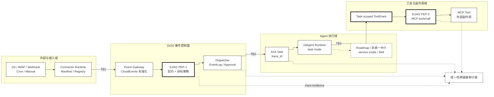
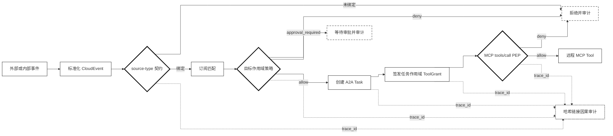

# E2AG：面向事件驱动智能体操作系统的能力契约接入、策略门控与因果审计

> 投稿目标：《软件学报》“人工智能操作系统及其安全”专刊
>
> 稿件状态：匿名审稿主稿 V0.8（2026-08-14）
>
> 匿名状态：作者、单位、通讯方式及可识别仓库版本信息已从审稿稿件移除
>
> 实现基线：匿名审稿版本；录用后恢复公开仓库、分支与提交号

## 投稿选题定位

依据《软件学报》“人工智能操作系统及其安全”专刊 2026 年 4 月 16 日发布的官方征文范围，本文的**主选题**定位为“AIOS 基础安全理论与技术”中的**智能体协同安全与调度防护机制**。E2AG 的强制点位于 Event-to-Agent 调度临界区，其研究对象是外部事件触发智能体执行时的接入、授权与审计安全，而非泛化的 AIOS 产品架构。

本文同时覆盖三个次级方向：以攻击成功率、正常通过率、审计篡改检测和延迟消融对应“系统安全度量与评估方法”；以目标 Agent 能力约束和 A2A trace 传播对应“多智能体协同场景下的软件安全机制”；以因果审计链及后续根因定位实验对应“软件异常行为检测与根因分析”。“系统安全架构设计”是实现载体，不单独作为缺少形式化验证的理论贡献；“全链路安全与应用实践”仅作为开源原型属性，不宣称已经完成工业部署。

## 摘要

事件驱动人工智能操作系统连接外部事件、智能体运行时、大模型与工具生态，使系统能够自主触发并执行任务，但事件接入、任务创建和工具调用跨越多个信任边界。本文提出 E2AG（Event-to-Agent Governance）：将 Connector manifest 扩展为可执行的 source–event type 能力契约，在 A2A Task 创建前执行目标作用域三态策略，为任务签发短期工具授权并在 MCP 调用点再次强制，同时使用统一 `trace_id` 和哈希链接证据链记录契约、策略、调度、授权与工具结果。本文在 DiOS 原型上实现 E2AG。作者冻结的 60 例威胁矩阵包含 30 个正常与 30 个攻击事件；无机制、仅契约、仅策略和契约＋策略的攻击阻断率分别为 0%、33.33%、66.67% 和 100%，四组均通过 30/30 个正常事件。进一步执行 480 次真实 dispatcher、SQLite、A2A Task、ToolGrant 与 MCP PEP 路径：双执行点同时开启时，30/30 个正常调用到达模拟上游，伪造来源、任务后工具升级和生产敏感动作三类禁止副作用均为 0/30；只启用任一执行点会暴露其未覆盖阶段。对 5 类注入故障生成的 100 条持久化 trace 均能定位首个治理失败阶段并通过链校验。并发实验发现原始去重存在 check-then-insert 竞态；引入数据库唯一去重声明后，SQLite 下 8/32 并发各 100 轮均未产生重复日志或双重审批。上述结果证明的是威胁驱动确定性场景中的机制互补性与执行闭环，不代表任意提示词注入检测、跨数据库一致性或生产部署效果。

**关键词：** 人工智能操作系统；智能体安全；事件驱动系统；能力契约；策略门控；因果审计

## E2AG: Capability-Contract Admission, Policy Gating, and Causal Auditing for Event-Driven Agent Operating Systems

### Abstract

Event-driven agent operating systems connect external events to agent runtimes and tools across multiple trust boundaries. We present E2AG (Event-to-Agent Governance), which turns connector manifests into executable source–event type contracts, performs target-scoped three-way policy decisions before A2A task creation, issues short-lived task-scoped tool grants, re-enforces them at the MCP call site, and records contract, policy, dispatch, grant, and tool outcomes in a trace-consistent hash-linked chain. In an author-frozen matrix of 30 benign and 30 attack events, attack prevention is 0%, 33.33%, 66.67%, and 100% for no mechanism, contract only, policy only, and contract plus policy; all four configurations pass 30/30 benign events. Across 480 executions using the real DiOS dispatcher, SQLite models, A2A Task, ToolGrant, and MCP PEP paths, the two-PEP configuration preserves 30/30 authorized upstream effects while each of three forbidden-effect scenarios reaches the upstream 0/30 times. Disabling either PEP exposes its uncovered stage. One hundred persisted traces across five injected fault stages are all localized correctly and remain hash-valid. A concurrency experiment exposes a check-then-insert replay race; after adding a database-unique time-bounded deduplication claim, 8- and 32-way SQLite tests over 100 rounds each show no duplicate log or double approval. These results establish mechanism behavior in deterministic threat-driven scenarios, not general prompt-injection detection, cross-database correctness, or production effectiveness.

**Keywords:** agent operating system; agent security; event-driven system; capability contract; policy enforcement; causal audit

## 1 引言

智能体操作系统（Agent OS/AIOS）试图把模型、上下文、存储、外部工具和智能体调度从应用中抽离，形成统一的资源与执行控制面。已有 AIOS 工作说明，对大模型和外部工具的无限制访问会带来资源分配与潜在危害问题，并将调度、存储与访问控制视为内核服务[1]；相关综述也把工具使用、记忆、规划和执行环境视为自主智能体的共同组成[2]。与此同时，工程系统正广泛采用 Git Webhook、电子邮件、告警、定时器及业务回调触发智能体。这使攻击者不必直接与模型对话，只需控制智能体将要读取的事件数据，就可能形成间接提示词注入，并影响后续 API 或工具调用[3–5]。

事件驱动链路的安全控制目前呈碎片化状态。Webhook 签名校验关注传输真实性；CloudEvents 规定 `id`、`source`、`specversion` 和 `type` 等上下文属性以实现互操作[6]；A2A 协议通过 Agent Card 描述能力，并用 Task 与 `contextId` 组织交互[7]；MCP 规定主机、客户端、服务端之间的工具暴露与 `tools/call` 交互，但把同意和访问控制留给实现方[8]；通用策略引擎把策略决策点（PDP）和策略执行点（PEP）分离[9]；分布式追踪规范则解决跨服务上下文传播[10]。单独采用其中任一机制，都无法约束一条完整的 Event-to-Agent 执行链。

本文关注如下问题：在外部事件已经进入 AIOS、但智能体尚未开始执行的临界点，系统如何统一约束事件声明权、目标智能体能力和高风险动作，并保留可验证的决策因果证据？我们的核心判断是：事件结构不是授权，智能体能力发现也不是调用授权，普通可观测性 trace 更不是安全证据。三者必须在调度前形成可执行闭环。

本文提出 E2AG（Event-to-Agent Governance）。E2AG 不依赖大模型判断安全性，而在确定性控制面完成三项工作：

1. 将 Connector manifest 中的能力声明转化为可执行的 source–event type 接入契约，未绑定的事件默认拒绝；
2. 针对具体目标智能体，以事件来源、类型、声明动作、请求工具和环境为上下文执行 `allow`、`deny`、`approval_required` 三态判定；
3. 为契约、策略、调度及 A2A Task 传播同一 `trace_id`，并用前向哈希链接形成可校验的因果证据链。

本文的贡献如下：

- 提出 Event-to-Agent 跨层威胁模型，区分事件格式合规、来源声明权、目标能力授权和执行证据完整性；
- 设计“契约接入—策略门控—因果审计”统一控制链，并说明三项机制的职责边界；
- 在 DiOS 最新开发基线上实现调度前强制点、三态决策、审计持久化与 A2A trace 传播，提供不依赖模型的确定性测试；
- 在 60 例冻结威胁矩阵上完成 Contract×Policy 2×2 消融，并以 480 次持久化 Event→Agent→Tool 执行、100 条执行依赖定位 trace 和并发竞态实验验证双执行点与审计闭环。

本文的新颖性不在于重新发明 CloudEvents、A2A、MCP、PDP/PEP 或哈希链，而在于定义并实现一个跨层授权生命周期：外部事件先证明 source–type 声明权，再取得目标 Agent 的任务创建权；任务只获得与其 `trace_id` 和 `task_id` 绑定的工具能力，实际副作用在 MCP 调用点再次强制；各阶段的对象标识和决策结果进入同一执行依赖证据链。由此，事件接入控制和工具运行时控制不再是两个彼此无关的安全检查。

上述工作直接面向专刊所列“智能体协同安全与调度防护机制”问题：契约和策略决定事件能否进入调度，因果审计则为调度防护的度量、异常分析与复核提供证据。

## 2 背景与问题定义

### 2.1 DiOS 事件控制面

DiOS[11] 与 DiAgent 在 DiFlow 工具链中承担不同职责：DiOS 管理 Agent、模型、MCP、Connector 等资源，并负责事件接入、路由、任务调度和执行追踪；DiAgent 负责单个智能体的模型、上下文、Skill 与工具交互。因而本文把 DiOS 视为一个正在演进的事件驱动 Agent 控制面原型，而非已经完备的企业级 AIOS。该定位既解释了 E2AG 的系统落点，也避免把未来 Roadmap 能力写成当前事实。

当前开发分支已经包含 Connector manifest/registry、CloudEvents 标准化、事件去重、订阅匹配、重试和 A2A Task。EventLog 表示事件，A2ATask 表示一次智能体调用，两者通过 `context_id=EventLog.id` 关联。Connector 覆盖 GitHub/GitLab/Gitea、IMAP、通用 Webhook，以及 Cron/Manual 内建事件；task-mode Agent 由隔离的 DiAgent 运行时执行，并可获得系统分配的 MCP 配置。

这一基线具备实现 E2AG 的关键“窄腰”：所有事件最终都在 dispatcher 创建 A2A Task。将第一个 PEP 设置于此，可覆盖 Webhook、轮询和内建事件，且无需侵入每个 Connector；将第二个 PEP 设置于远程 MCP 调用点，可在工具产生副作用前重新校验任务授权。但基线 manifest 只面向展示和订阅声明事件类型，尚不能强制判断一个 `source` 与一个 `type` 是否属于同一 Connector 契约；`Agent.capabilities` 也未参与事件投递授权。图 1 给出本文所涉及的 DiOS 子架构与 E2AG 落点。



图中细单线框是当前 DiOS/DiAgent 基线，粗线框是 E2AG 新增或强化的治理机制，虚线框表示 Roadmap 或本文尚未统一中介的路径，TB1–TB3 标识三处信任边界，点线框表示审计证据。全部语义由形状和线型编码，不依赖颜色。该图只用于说明论文相关的系统上下文，不把 DiOS 管理界面、模型服务和全部应用层能力列为本文贡献。

### 2.2 格式、能力与授权的差异

CloudEvents 解决的是事件描述与互操作问题。其 `source` 标识事件发生上下文，`type` 描述事件类型，`source+id` 可供消费者识别重复事件。然而，一个结构正确的 CloudEvent 不等于来源有权声明任意 `type`。例如，`source=webhook/attacker` 与 `type=git.push` 可以同时满足字段类型要求，却不应触发只信任 Git Connector 的智能体。

A2A Agent Card 描述身份、能力、技能、端点与认证需求，`contextId` 用于把多个 Task/Message 组织为逻辑上下文。这些信息有利于发现和连续交互，但“声称支持能力”仍不等于“当前事件获准使用能力”。E2AG 因而把发现信息转换成目标作用域的运行时约束。

### 2.3 安全目标

设事件为 $e$，目标智能体集合为 $A_e$，Connector 能力契约集合为 $C$，策略集合为 $P$。E2AG 要求在创建任何任务之前满足：

$$
\operatorname{Admit}(e,A_e)=\operatorname{Bound}(e,C)\land\operatorname{Permit}(e,A_e,P).
$$

若 `Bound` 为假，事件必须拒绝；若 `Permit` 判断为高风险且可审批，事件进入等待态；只有两者均允许才创建 A2A Task。系统同时生成证据序列 $L=(l_0,\ldots,l_n)$，其中每一项包含相同 `trace_id`，并满足：

$$
h_i=H(\operatorname{canon}(l_i\setminus\{h_i\})),\quad l_i.\mathrm{previous\_hash}=h_{i-1},\quad h_{-1}=\epsilon.
$$

审计校验器检查序号、trace 连续性、前驱哈希与内容哈希。该结构提供链内篡改检测，但数据库管理员仍可能整体删除或回滚整条链；外部锚定属于未来工作。

## 3 威胁模型

### 3.1 攻击者能力

攻击者可提交或影响 Webhook、邮件、Git 内容和通用事件载荷；可构造结构化字段和自然语言；可重放已观察事件；可利用订阅通配符；也可诱导智能体请求未授权工具或生产资源。攻击者不能直接修改 DiOS 进程内策略、目标智能体治理配置或数据库代码，但可能尝试通过事件内容混淆这些边界。

### 3.2 保护对象与信任边界

保护对象包括 Connector 凭据、Agent Prompt/模型/Skill/MCP、工作区、生产网络、Secret、执行产物和审计记录。主要边界位于外部系统与 Connector、Connector 与 Event Gateway、Gateway 与 dispatcher、dispatcher 与 A2A/Runtime、Runtime 与模型/工具之间。

### 3.3 攻击类别

- **来源—类型混淆：** 用合法字段组合伪造未绑定的 `source/type`；
- **跨租户或跨项目路由：** 合法 Git 事件来自未授权组织，却匹配过宽订阅；
- **动作与工具越权：** 低风险事件请求 shell、管理、Secret 或生产写能力；
- **意图缺失：** 载荷只有自然语言指令，没有可供控制面授权的结构化动作；
- **高风险副作用：** 删除、凭据轮换或生产网络写入未经人工确认；
- **审计断链：** 修改中间决策或使 EventLog 与 A2ATask 丢失关联。

E2AG 当前不试图从任意自然语言中准确识别恶意语义。若攻击者声明一个获准动作，同时把注入内容隐藏在业务数据中，控制面只能限制其可达的智能体、工具和动作；仍需工具调用时 PEP、数据流控制或模型侧防御。这一限制在实验解释中单独报告。

## 4 E2AG 设计

### 4.1 执行流程



原型的契约计算和订阅匹配均无外部副作用；实际强制点位于 dispatcher 开头、A2A Task 创建之前。这意味着订阅匹配可能先计算候选目标，但任何智能体执行仍必须经过 E2AG。

### 4.2 能力契约接入

E2AG 在已有 `ConnectorManifest` 中新增 `accepted_source_patterns`。运行时将 manifest 的 source pattern 与 event type 做笛卡尔绑定；内建/场景 namespace 则沿用其显式 `source_pattern—event_types` 对。契约判定首先验证 DiOS 所需字段 `specversion/id/source/type/data`，再查找唯一可接受绑定。当前 Git、IMAP、Generic 与 Internal 合同示例如下：

| Connector | 可接受 source | 可接受 type 示例 |
|---|---|---|
| git_webhook | `github/*`, `gitlab/*`, `gitea/*` | `git.push`, `git.issue.*`, `git.pull_request.*` |
| imap | `imap/*` | `email.received` |
| generic | `webhook/*` | `webhook.received` |
| internal | `manual/*`, `cron/*` | `manual.trigger`, `cron.tick` |

契约输出包含 `decision`、稳定 reason code、contract type、匹配 pattern、策略版本和判定延迟。实现采用默认拒绝：结构异常、规范版本异常、未知类型或未绑定组合均不可进入 Agent。

### 4.3 目标作用域策略门控

每个 Agent 可在现有 `capabilities.governance` 中声明：

```json
{
  "allowed_event_sources": ["github/acme/*"],
  "allowed_event_types": ["git.pull_request.*"],
  "allowed_tools": ["git.read", "git.comment"],
  "allowed_actions": ["git.review"],
  "require_action_declaration": true
}
```

PEP 加载所有候选 Agent 的治理声明并进行合取判定。目标 Agent 完全缺失 `capabilities.governance` 时默认拒绝；已有治理对象中缺失的单个维度暂不施加限制，已声明列表则具有 allow-list 语义。对于启用 `require_action_declaration` 的 Agent，载荷必须给出结构化动作。生产环境中的 `admin.*`、`credential.*`、`secret.*`、`filesystem.delete` 和 `network.production.write` 等动作返回 `approval_required`。三态结果被持久化，不把待审批事件误当作失败事件重试。每个待审批事件生成一个有时限的 Approval；其状态只能从 `pending` 单次转移为 `approved`、`rejected` 或 `expired`。只有批准分支复用原 EventLog 的 `trace_id` 恢复 A2A fan-out，拒绝、过期和重复决策均不创建任务。

原型提供 `off`、`contract`、`enforce` 三种运行模式以支持消融。未知模式回退到 `enforce`，避免配置错误导致静默放行。

策略门控不是一次性接入判断。对于事件触发的 task-mode Agent，原型把远程 `streamable_http` MCP 配置改写到 DiOS 内部 PEP，并签发绑定 `trace_id/task_id/agent_id/mcp_server_id` 和 `allowed_tools` 的短期 ToolGrant。数据库只存授权令牌 SHA-256 摘要；任务完成、失败或取消时撤销授权，过期或任务绑定不一致的令牌在调用点拒绝。`tools/list` 响应也按授权模式裁剪，避免先暴露完整工具面。任何越权 `tools/call` 在接触上游及其长期凭据前被拒绝并写入同一审计链。

### 4.4 因果审计：执行依赖溯源

每个 EventLog 生成 128 bit 随机 `trace_id`。该标识写入 EventLog、A2ATask 和发送给 Agent 的 A2A message 扩展。审计链至少包含 contract、policy 和 dispatch 三个阶段；创建任务后再记录 `task_id` 与 `agent_id`。每个条目包含 `sequence`、`stage`、`outcome`、`evidence`、`previous_hash` 与 `entry_hash`。验证函数可发现内容、顺序、trace 或前驱链接的修改。

被拒绝与待审批事件同样创建 EventLog，但不创建 A2ATask；这既保留攻击证据，也使“审计成功”与“执行发生”解耦。数据库迁移为历史 SQLite 增加相应 JSON/text 字段和 trace 索引。

本文所称“因果”是安全执行溯源中的对象依赖与 happens-before 关系，不是从观测数据估计处理效应的统计因果推断。令事件、任务、工具授权和实际工具调用分别为 $e,t,g,c$，正常执行形成 $e\prec t\prec g\prec c$；需要人工批准时，Approval 位于 $e$ 与 $t$ 之间。E2AG 在 `enforce` 模式下维护四个可检查不变量：

1. **任务接入不变量 I1。** 创建 $t$ 必须已有同一 trace 上的契约允许，并满足策略直接允许，或策略要求审批且 Approval 已批准；`trace(t)=trace(e)`。
2. **副作用授权不变量 I2。** 上游收到工具调用 $c$ 必须存在状态为 active、未过期且未撤销的 $g$；其 `trace_id/task_id/agent_id/mcp_server_id` 与当前执行对象一致，且 `tool(c)` 属于 `allowed_tools(g)`。
3. **审批线性不变量 I3。** 一个 Approval 只能从 pending 单次转移到 approved、rejected 或 expired；只有 approved 能沿原 trace 恢复一次 fan-out。
4. **证据连续性不变量 I4。** 对同一 trace 的第 $i$ 个条目，`sequence=i` 且 `previous_hash_i=entry_hash_{i-1}`；条目证据中的 event/task/grant/tool 标识必须符合上述依赖关系。

I1–I3 是执行安全属性，I4 是持久化证据属性。当前哈希链证明存储后的顺序和内容没有发生链内修改，但没有外部 head/count 锚点，因而不把它表述为一般程序根因分析、统计因果推断或不可抵赖日志。

## 5 原型实现

E2AG 在 DiOS 后端以一个无副作用判定模块实现，核心代码不依赖 SQLAlchemy、FastAPI 或模型 SDK，便于单元测试、重放和微基准。dispatcher 负责加载目标 Agent 能力、调用判定、持久化审计及阻断 A2A fan-out。A2A service 新增可选 `trace_id` 参数，并保证 Task、协议返回和 message 扩展的一致传播。

当前实现新增或修改的主要组件如下：

| 组件 | 实现内容 |
|---|---|
| `connectors/contracts.py` | source–type 可执行契约字段 |
| `services/e2ag.py` | 纯函数契约/策略判定与哈希链校验 |
| `services/event_dispatcher.py` | A2A 创建前 PEP、三态阻断与审计 |
| `services/a2a_service.py` | trace 贯通 A2ATask 和 message |
| `services/e2ag_tool_gateway.py` | 任务作用域 ToolGrant、MCP 方法/工具授权与撤销 |
| `services/e2ag_approval.py` | 有时限、单次消费的批准/拒绝/过期状态机 |
| `api/internal/e2ag_mcp.py` | 远程 streamable HTTP MCP 执行点 PEP 与工具发现裁剪 |
| `models/tables.py`, `db/database.py` | 审计持久化与兼容迁移 |
| `tests/test_e2ag*.py` | 决策与真实异步 SQLite 集成测试 |
| `experiments/e2ag` | 攻击夹具、消融和微基准脚本 |

截至本稿，30 个自动测试全部通过。其中 12 个覆盖纯判定和哈希篡改，6 个覆盖真实异步 SQLite dispatcher/A2A 路径（含相同事件 replay 去重），9 个覆盖工具网关及其任务生命周期，3 个覆盖审批状态机。后两组验证拒绝调用不会到达 mocked upstream、授权调用才携带上游凭据转发、工具发现结果按能力裁剪且畸形响应默认返回空列表、令牌只存哈希且具有任务绑定/到期/撤销语义、任务专用明文令牌配置被精确清理，以及审批拒绝不可翻转、过期不可恢复、批准沿同一 trace 只恢复一次 fan-out。

## 6 实验设计

### 6.1 研究问题

- **RQ1：** source–type 契约与目标作用域策略是否分别贡献安全收益，组合后是否互补？
- **RQ2：** 调度前 PEP 与 MCP 调用时 PEP 是否能在真实持久化执行链中共同阻止禁止副作用？
- **RQ3：** 统一 trace 和哈希链能否完整关联执行阶段并定位治理失败点，其并发状态不变量是否成立？

### 6.2 对照与数据集

RQ1 使用完整 2×2：C0P0（契约、策略均关闭）、C1P0（仅契约）、C0P1（仅策略）和 C1P1（均开启）。正式冻结集为 60 例，其中 30 个正常事件、30 个攻击事件；攻击包括 10 个 source–type 绑定攻击、16 个目标 source/type/action/tool 或意图攻击，以及 4 个应转审批的生产敏感动作。语料覆盖 GitHub、GitLab、Gitea、IMAP、通用 Webhook、Manual 和 Cron，SHA-256 为 `8c0074fc...a096a6`。所有事件均满足基本结构要求，以隔离 source–type 绑定与目标策略的贡献。该语料是作者冻结威胁矩阵，独立合作者标签复核尚待完成。

RQ2 使用 G0R0、G1R0、G0R1、G1R1 四组，G 表示调度前 PEP，R 表示 MCP 调用时 PEP。四类场景为正常授权调用、伪造来源、任务创建后的工具升级和生产敏感动作，每个“配置×场景”重复 30 次，共 480 次。执行使用真实 DiOS dispatcher、SQLite 模型、A2A Task、ToolGrant、MCP PEP 和审计链；Agent 决策和远程 MCP 为确定性测试替身，不使用 LLM、容器和外部网络。主要观测上游是否真正收到调用及 canary 副作用是否发生，而非只读取授权函数返回值。

### 6.3 指标与环境

RQ1 报告攻击阻断率、正常通过率、各治理层计数和 Wilson 95% 置信区间。RQ2 报告 Task/Approval/Grant 创建数、上游调用数、允许/禁止副作用数、审计链有效性和路径阶段完整性。RQ3 对契约拒绝、策略拒绝、审批过期、ToolGrant 过期、MCP 工具拒绝各注入 20 次，报告阶段定位、trace 完整性和哈希校验；另对 8/32 并发 replay 与 approve/reject 各运行 100 轮。性能仅作为同机随机配对的工程观察：30 批、每批 1200 次判定，不作为独立研究问题或生产性能证据。

## 7 实验结果

### 7.1 RQ1：Contract×Policy 完整消融

| 模式 | 阻断攻击 | 攻击阻断率 | Wilson 95% CI | 正常通过 | 正常通过率 | Wilson 95% CI |
|---|---:|---:|---:|---:|---:|---:|
| C0P0 | 0/30 | 0.00% | [0.00%, 11.35%] | 30/30 | 100.00% | [88.65%, 100%] |
| C1P0 | 10/30 | 33.33% | [19.23%, 51.22%] | 30/30 | 100.00% | [88.65%, 100%] |
| C0P1 | 20/30 | 66.67% | [48.78%, 80.77%] | 30/30 | 100.00% | [88.65%, 100%] |
| C1P1 | 30/30 | 100.00% | [88.65%, 100%] | 30/30 | 100.00% | [88.65%, 100%] |

C1P0 只阻断 10 个契约绑定攻击；C0P1 阻断 16 个目标能力攻击，并将 4 个生产敏感动作转为待审批；C1P1 合并两类控制点。结果与冻结威胁矩阵的层次设计一致，支持机制分工和组合闭环，但不是未知攻击检出率。由于独立标签复核尚未完成，本文称其为“作者冻结威胁矩阵”，不称独立测试集。

### 7.2 RQ2：双执行点与上游副作用

| 配置 | 正常调用到达上游 | 伪造来源禁止副作用 | 工具升级禁止副作用 | 敏感动作禁止副作用 |
|---|---:|---:|---:|---:|
| G0R0 | 30/30 | 30/30 发生 | 30/30 发生 | 30/30 发生 |
| G1R0 | 30/30 | 0/30 | 30/30 发生 | 0/30（进入审批） |
| G0R1 | 30/30 | 30/30 发生 | 0/30 | 0/30 |
| G1R1 | 30/30 | 0/30 | 0/30 | 0/30（进入审批） |

调度前 PEP 能阻断伪造来源并将高风险动作转为审批，但不能阻止任务创建后的工具升级；MCP PEP 能阻断未授权工具，却无法判断一个获准工具是否由伪造来源触发。G1R1 保持 30/30 个正常副作用，并使三类禁止副作用均为 0/30。480/480 条链通过哈希校验且包含各自路径所需阶段。该实验使用确定性 Agent 和 MCP 测试替身，证明的是系统强制路径，而非 LLM 识别恶意语义的能力。

### 7.3 RQ3：执行依赖阶段定位

| 注入故障 | trace 数 | 正确定位 | 链有效 | 阶段完整 |
|---|---:|---:|---:|---:|
| 契约拒绝 | 20 | 20 | 20 | 20 |
| 策略拒绝 | 20 | 20 | 20 | 20 |
| 审批过期 | 20 | 20 | 20 | 20 |
| ToolGrant 过期 | 20 | 20 | 20 | 20 |
| MCP 工具拒绝 | 20 | 20 | 20 | 20 |

100/100 条 trace 均使用同一 `trace_id`，包含预期阶段并定位到首个终态治理失败点。该定位依赖 E2AG 显式 stage/outcome 语义，不等同于一般程序根因分析。另对内容修改、换序、trace/前驱替换、中间删除和伪造证据插入的 6 类链内篡改均能检出；无外部 head/count 锚点时链尾截断仍不可检测。

### 7.4 并发 replay 与审批竞态

修复前，8 并发 replay 的 100/100 轮均持久化多条 EventLog，共创建 588 条日志而不是 100 条，暴露 check-then-insert 竞态。原型随后增加数据库唯一、带过期时间的 `EventDedupClaim`。修复后结果如下：

| 场景 | 并发 | 轮数 | 请求数 | 创建/成功终态 | 正确判重/冲突 | 不变量违规 |
|---|---:|---:|---:|---:|---:|---:|
| replay | 8 | 100 | 800 | 100 | 700 | 0 |
| replay | 32 | 100 | 3200 | 100 | 3100 | 0 |
| approve/reject | 8 | 100 | 800 | 100 | 700 | 0 |
| approve/reject | 32 | 100 | 3200 | 100 | 3100 | 0 |

该结果验证 SQLite 单机文件数据库与独立异步会话下的状态不变量，不外推 PostgreSQL/MySQL 或多地域部署。修复前 32 并发数据因实验输入与前一阶段哈希碰撞而无效，不用于结论。

### 7.5 附属开销观察

同机随机配对 30 批中，C1P1 每次判定的批次均值中位数为 11.228 μs，P95 为 12.896 μs。C0P0 近似空函数，故不报告容易误导的相对倍数。该观察仅排除控制面纯判定出现数量级退化，不包含数据库、Agent、模型和网络，也不支持生产端到端性能结论。

## 8 讨论与限制

**语义攻击。** E2AG 不是提示词注入分类器。结构化意图和能力 allow-list 可降低攻击可达面，运行时 MCP PEP 可阻止模型越出获准工具集合；但恶意载荷若诱导同一个已授权工具使用危险参数，当前工具名粒度策略仍可能放行，后续需加入参数级谓词与数据流约束。

**可信声明。** 当前动作和工具字段随事件数据到达，攻击者可以伪造声明。严格模式通过 `require_action_declaration` 防止完全隐式意图，但声明本身仍需与具体 handler/skill 绑定，不能只依赖事件自述。论文后续将区分“不可信请求意图”和“系统推导的计划动作”。

**审批身份。** 原型已实现批准、拒绝、过期与数据库条件更新支持的单次消费状态机；但审批 API 沿用 DiOS 可选 Access Token 门禁，`actor` 是客户端提交的审计字段，尚未接入独立身份提供方、RBAC、多人复核或职责分离。因此本文主张的是可审计的 HITL 状态机，不是强身份审批系统。

**工具传输覆盖。** 当前执行点 PEP 仅覆盖事件触发的 task-mode Agent 与远程 `streamable_http` MCP。为维持默认拒绝，enforce 模式不把 stdio 或 SSE MCP 下发给这类任务；service-mode Agent、Skill 内部调用、MCP 流式响应背压、工具参数授权及独立 Agent 运行时中的旁路调用尚未完成统一中介。因此当前不能声称覆盖 DiOS 的所有工具执行路径。

**审计强度。** 哈希链可检测链内修改，但无法抵御高权限管理员删除整条记录、截断尾部或回滚数据库。可采用外部透明日志、周期 Merkle root 锚定或签名存储增强不可抵赖性。

**外部有效性。** 当前实现在单一开源系统上完成，60 例语料是作者冻结的威胁驱动矩阵，独立合作者标签复核仍待完成；确定性 Agent/MCP 测试替身不能替代真实 LLM 红队、生产凭据与外部网络。并发结果只验证 SQLite，PostgreSQL/MySQL 和多实例部署尚未实测。固定种子 700 次变异去重后只有 319 个不同用例，因此仅作为机制覆盖附录，不作为独立样本规模。

## 9 相关工作

**AIOS 与国内安全研究。** AIOS 将模型、工具、上下文和资源管理下沉到类似操作系统内核的控制层[1]，自主智能体综述则从规划、记忆、工具使用和环境交互总结其通用结构[2]，二者为 E2AG 提供了系统落点。国内研究已从模型自身安全、生成内容安全、生命周期攻击与隐私风险等角度形成较完整的分类、评估和缓解综述[12–13]；张熙等进一步面向大模型智能体讨论信息泄露、模型攻击、幻觉和合规风险及应对机制[14]。这些工作回答“风险有哪些、如何分类和缓解”，本文则聚焦其较少展开的系统控制面问题：外部事件怎样获得任务创建权、一次任务怎样获得工具副作用权限，以及拒绝或审批决定怎样形成可复核证据。

**攻击评测与系统级防护。** 间接提示词注入揭示了不可信外部数据混淆指令与数据的根因[3]；InjecAgent 和 AgentDojo 分别提供工具集成智能体的静态测试集与可扩展动态环境[4–5]；ToolEmu 用模型仿真工具沙箱识别长尾风险[15]。这些工作主要用于暴露或度量模型介导的攻击面。AgentSpec 以领域专用语言在动作前执行可定制规则[16]，CaMeL 则显式分离可信查询的控制流与不可信数据流，并在工具调用时实施能力策略[17]，与 E2AG 的确定性执行思路最接近。区别在于，E2AG 的授权对象从模型计划前移到外部事件，显式绑定 `source–type–target`，并在任务创建和真实 MCP 调用两处执行同一任务作用域授权；它不能替代 CaMeL 的参数级数据流控制，两者是互补关系。

**协议、策略与证据。** CloudEvents、A2A 和 MCP 分别提供事件、智能体任务和工具调用的互操作语义[6–8]，但协议描述本身不是跨层授权。OPA 的 PDP/PEP 分离为结构化策略执行提供了通用基础[9]；W3C Trace Context 解决跨服务标识传播[10]，却不保证安全决策未被修改。Haber–Stornetta 的时间戳链和 in-toto 的步骤级供应链证据说明，哈希链接或签名可使过程记录具备可验证完整性[18–19]。E2AG 将这些基础机制收敛到同一 `trace_id`，但当前哈希链没有外部锚定，不能抵抗整链删除或数据库回滚。

下表按研究目标比较代表性工作。这里的差异不是以“是否安全”作二元评价，而是说明各工作约束的链路位置；E2AG 的新增点是把事件声明权、目标调度权、工具执行权和因果证据放入同一可执行闭环。

| 类别 | 代表性工作 | 主要约束位置或机制 | 与 E2AG 的关系 |
|---|---|---|---|
| AIOS 与智能体体系 | AIOS、智能体综述、DiOS[1–2,11] | 模型、记忆、调度、工具和运行资源 | 提供控制面载体；未单独给出外部事件到工具的治理闭环 |
| 国内安全综述 | 黄河燕等、牟奕洋等、张熙等[12–14] | 模型/内容/隐私风险分类及智能体可信建议 | 提供风险体系；E2AG 补充可执行控制点与系统证据 |
| 攻击与评测 | 间接注入、InjecAgent、AgentDojo、ToolEmu[3–5,15] | 不可信数据到模型/工具的攻击与风险评估 | 给出威胁和评测环境；不等同于生产链路强制授权 |
| 运行时防护 | AgentSpec、CaMeL[16–17] | 动作规则、控制/数据流分离、工具调用策略 | 与 PEP-2 互补；E2AG 进一步覆盖事件来源和任务创建 |
| 互操作协议 | CloudEvents、A2A、MCP[6–8] | 事件格式、任务交互、工具协议 | 提供跨层对象；协议能力声明不直接构成调用授权 |
| 策略与证据基础 | OPA、Trace Context、时间戳链、in-toto[9–10,18–19] | PDP/PEP、标识传播、哈希或签名证据 | E2AG 将其组合成任务作用域策略和因果审计 |
| 本文 E2AG | 契约接入、双 PEP、审批、哈希链 | Event → Task → Tool | 统一约束事件声明权、目标调度权和工具执行权 |

## 10 结论

本文提出 E2AG，将事件能力契约、目标作用域策略门控、任务作用域工具授权和哈希链接因果审计部署在 Event-to-Agent 执行链的两个临界点。60 例 Contract×Policy 完整消融显示两类控制点在冻结威胁矩阵上互补；480 次持久化执行说明调度前 PEP 和 MCP PEP 分别约束事件入口与实际工具副作用；100 条注入故障 trace 验证了显式治理阶段的关联和定位。并发实验还发现并修复了原始 replay 去重竞态。上述证据支持一个确定性原型机制闭环，不支持任意提示词注入检测、跨数据库正确性或生产部署泛化；参数级策略、完整传输覆盖、外部审计锚定和跨 AIOS 验证仍是后续工作。

## 参考文献

[1] Mei K, Zhu X, Xu W, et al. AIOS: LLM Agent Operating System. arXiv:2403.16971, 2024.

[2] Wang L, Ma C, Feng X, et al. A survey on large language model based autonomous agents. Frontiers of Computer Science, 2024, 18: 186345. [doi: 10.1007/s11704-024-40231-1]

[3] Greshake K, Abdelnabi S, Mishra S, et al. Not What You've Signed Up For: Compromising Real-World LLM-Integrated Applications with Indirect Prompt Injection. arXiv:2302.12173, 2023.

[4] Zhan Q, Liang Z, Ying Z, Kang D. InjecAgent: Benchmarking indirect prompt injections in tool-integrated large language model agents. In: Proc. of the Findings of the Association for Computational Linguistics: ACL 2024. Bangkok: Association for Computational Linguistics, 2024. 10471–10506. [doi: 10.18653/v1/2024.findings-acl.624]

[5] Debenedetti E, Zhang J, Balunović M, et al. AgentDojo: A dynamic environment to evaluate prompt injection attacks and defenses for LLM agents. Advances in Neural Information Processing Systems, 2024, 37: 82895–82920. [doi: 10.52202/079017-2636]

[6] Cloud Native Computing Foundation. CloudEvents Specification, Version 1.0.2, 2022. https://github.com/cloudevents/spec/tree/ce@v1.0.2. [2026-08-14]

[7] A2A Protocol Working Group. Agent2Agent Protocol Specification. https://a2a-protocol.org/latest/. [2026-08-14]

[8] Model Context Protocol Contributors. Model Context Protocol Specification, Revision 2025-06-18. https://modelcontextprotocol.io/specification/2025-06-18/. [2026-08-14]

[9] Open Policy Agent. OPA Documentation: Policy Decision and Enforcement. https://www.openpolicyagent.org/docs. [2026-08-14]

[10] W3C. Trace Context. W3C Recommendation, 2021. https://www.w3.org/TR/trace-context/.

[11] Anonymous. DiOS: DiFlow Intelligent Operation System. Anonymous software artifact, 2026.

[12] Huang HY, Li SL, Lan TW, et al. A survey on the safety of large language model: Classification, evaluation, attribution, mitigation and prospect. CAAI Transactions on Intelligent Systems, 2025, 20(1): 2–32 (in Chinese with English abstract). [doi: 10.11992/tis.202401006]

[13] Mu YY, Chen HX, Li HW. Advances in security and privacy-preserving techniques for large language models. Journal of Cybersecurity, 2024, 2(1): 40–49 (in Chinese with English abstract). [doi: 10.20172/j.issn.2097-3136.240103]

[14] Zhang X, Li CZ, Xu N, Zhang LT. Security challenges and response mechanisms for trustworthy large language model agents. Information and Communications Technology and Policy, 2025, 51(1): 33–37 (in Chinese with English abstract). [doi: 10.12267/j.issn.2096-5931.2025.01.005]

[15] Ruan Y, Dong H, Wang A, et al. Identifying the risks of LM agents with an LM-emulated sandbox. In: Proc. of the 12th Int'l Conf. on Learning Representations. Vienna: OpenReview, 2024.

[16] Wang H, Poskitt CM, Sun J. AgentSpec: Customizable runtime enforcement for safe and reliable LLM agents. In: Proc. of the 48th IEEE/ACM Int'l Conf. on Software Engineering. New York: ACM, 2026. 12 pages. [doi: 10.1145/3744916.3764546]

[17] Debenedetti E, Shumailov I, Fan T, et al. Defeating Prompt Injections by Design. arXiv:2503.18813, 2025.

[18] Haber S, Stornetta WS. How to time-stamp a digital document. Journal of Cryptology, 1991, 3(2): 99–111. [doi: 10.1007/BF00196791]

[19] Torres-Arias S, Afzali H, Kuppusamy TK, et al. in-toto: Providing farm-to-table guarantees for bits and bytes. In: Proc. of the 28th USENIX Security Symp. Santa Clara: USENIX Association, 2019. 1393–1410.

### 附中文参考文献

[12] 黄河燕, 李思霖, 兰天伟, 等. 大语言模型安全性：分类、评估、归因、缓解、展望. 智能系统学报, 2025, 20(1): 2–32. [doi: 10.11992/tis.202401006]

[13] 牟奕洋, 陈涵霄, 李洪伟. 大语言模型的安全与隐私保护技术研究进展. 网络空间安全科学学报, 2024, 2(1): 40–49. [doi: 10.20172/j.issn.2097-3136.240103]

[14] 张熙, 李朝卓, 许诺, 张力天. 面向可信大语言模型智能体的安全挑战与应对机制. 信息通信技术与政策, 2025, 51(1): 33–37. [doi: 10.12267/j.issn.2096-5931.2025.01.005]

## 附录 A：当前可复现命令

```powershell
cd backend
.\.venv\Scripts\python.exe -m unittest discover -s tests -v
cd ..
python experiments/e2ag/run_experiment.py --repeats 5000
python experiments/e2ag/run_audit_experiment.py
backend\.venv\Scripts\python.exe experiments/e2ag/run_frozen_ablation.py
backend\.venv\Scripts\python.exe experiments/e2ag/run_e2e_chain_experiment.py --repeats 30
backend\.venv\Scripts\python.exe experiments/e2ag/run_causal_audit_experiment.py --repeats 20
backend\.venv\Scripts\python.exe experiments/e2ag/run_concurrency_experiment.py --levels 8,32 --rounds 100
backend\.venv\Scripts\python.exe experiments/e2ag/run_dispatch_benchmark.py --repeats 500
backend\.venv\Scripts\python.exe experiments/e2ag/run_tool_gateway_experiment.py --repeats 10000
backend\.venv\Scripts\python.exe experiments/e2ag/run_mutation_experiment.py --per-operator 100
backend\.venv\Scripts\python.exe experiments/e2ag/run_http_benchmark.py --repeats 300
```

实验结果写入 `experiments/e2ag/results/`，依赖安装与中国大陆镜像命令见 `E2AG-reproducibility.md`。

## 附录 B：投稿前与后续实证项

1. 投稿前由一名未参与语料构造的合作者完成 60 例盲表复核，报告原始一致率、Cohen's kappa 和分歧处理历史；盲表与汇总脚本已经生成，人工填写仍待完成；
2. 扩展工具 PEP 到 SSE、受控 stdio、service-mode Agent 与 Skill 调用；
3. 将审批接入独立 IdP/RBAC，并增加多人复核与职责分离；
4. 实测 PostgreSQL 并发语义、真实 HTTP 代理与远端 MCP；
5. 为审计链加入外部 head/count 锚定并验证尾部截断检测；
6. 增加外部策略引擎适配或第二系统映射，以检验架构可迁移性。
