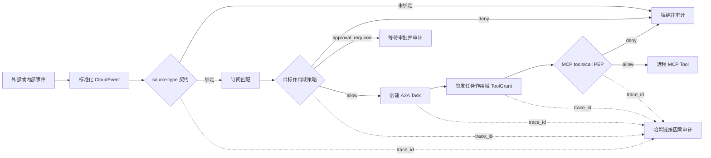

# E2AG：面向事件驱动智能体操作系统的能力契约接入、策略门控与因果审计

> 投稿目标：《软件学报》“人工智能操作系统及其安全”专刊
>
> 稿件状态：研究主稿 V0.2（2026-08-12）
>
> 实现基线：`feat/event-subscription-governance-20260418@72732a4`
>
> 论文实现分支：`codex/e2ag-research`
>
> 作者、单位、基金、分类号：待补

## 投稿选题定位

依据《软件学报》“人工智能操作系统及其安全”专刊 2026 年 4 月 16 日发布的官方征文范围，本文的**主选题**定位为“AIOS 基础安全理论与技术”中的**智能体协同安全与调度防护机制**。E2AG 的强制点位于 Event-to-Agent 调度临界区，其研究对象是外部事件触发智能体执行时的接入、授权与审计安全，而非泛化的 AIOS 产品架构。

本文同时覆盖三个次级方向：以攻击成功率、正常通过率、审计篡改检测和延迟消融对应“系统安全度量与评估方法”；以目标 Agent 能力约束和 A2A trace 传播对应“多智能体协同场景下的软件安全机制”；以因果审计链及后续根因定位实验对应“软件异常行为检测与根因分析”。“系统安全架构设计”是实现载体，不单独作为缺少形式化验证的理论贡献；“全链路安全与应用实践”仅作为开源原型属性，不宣称已经完成工业部署。

## 摘要

事件驱动人工智能操作系统连接外部事件、智能体运行时、大模型与工具生态，使系统能够自主触发并执行任务。然而，事件从接入、标准化、订阅匹配到智能体决策和工具调用跨越多个信任边界。传输层签名只能证明消息经过持有密钥的一方，CloudEvents 等互操作规范只描述事件结构，容器隔离则主要限制运行时边界；这些局部机制无法共同回答“某来源是否有权声明该事件、该事件是否可触发目标智能体的特定能力、执行为何发生且证据是否被篡改”等问题。本文提出 E2AG（Event-to-Agent Governance），一种部署在智能体操作系统事件控制面中的治理机制。E2AG 将 Connector manifest 扩展为可执行的 source–event type 能力契约，在任何 A2A Task 创建前执行面向目标智能体的三态策略判定，为任务签发短期工具授权，并使用统一 `trace_id` 与逐项哈希链接的证据链记录契约、策略、调度和实际工具调用。本文在开源 DiOS 原型上实现了最小闭环，并构造覆盖 Git、IMAP、通用 Webhook、Manual 与 Cron 的确定性攻击集。初步实验包含 14 个攻击事件和 8 个正常事件：无治理基线、仅契约基线和完整 E2AG 的攻击阻断率分别为 0%、35.71% 和 100%，正常事件通过率均为 100%；在 11 万次判定测量中，完整 E2AG 纯判定核心的 P50/P95/P99 延迟分别为 21.2/42.1/121.0 μs。工具执行点的附加实验在 6 个越权与 4 个正常方法/工具案例上，将越权阻断率从仅调度门控的 0% 提升到 100%，正常通过率保持 100%，纯授权函数 P50 为 1.8 μs。包含 EventLog 与哈希审计落库的 SQLite 控制面微基准显示，完整 E2AG 相对关闭治理的 P50 增量约 0.42 ms。6 类预期可检测的链内篡改均被发现，但无外部锚点时无法发现链尾截断。上述结果仅说明当前手工攻击集上的机制互补性与原型开销，不代表对任意提示词注入的普适检测能力。

**关键词：** 人工智能操作系统；智能体安全；事件驱动系统；能力契约；策略门控；因果审计

## E2AG: Capability-Contract Admission, Policy Gating, and Causal Auditing for Event-Driven Agent Operating Systems

### Abstract

Event-driven agent operating systems connect external events to agent runtimes, large language models, and tools. This execution path crosses multiple trust boundaries, while existing controls are typically local to webhook authentication, event interoperability, runtime isolation, or tool authorization. They do not jointly determine whether a source is entitled to assert an event type, whether the asserted intent fits the target agent's capabilities, and whether the resulting execution can be causally reconstructed with tamper evidence. We present E2AG (Event-to-Agent Governance), a control-plane mechanism that turns connector manifests into executable source–event type contracts, performs a target-scoped three-way policy decision before any A2A task is created, issues a short-lived task-scoped tool grant, and propagates a trace identifier through a hash-linked audit chain. We implement a minimal E2AG loop in the open-source DiOS prototype. In an initial deterministic corpus of 14 attacks and 8 benign cases spanning Git, IMAP, generic webhook, manual, and cron sources, attack prevention increases from 0% without governance and 35.71% with contract-only admission to 100% with full E2AG, while all benign cases pass. Across 110,000 measurements, the full in-process decision core shows P50/P95/P99 latencies of 21.2/42.1/121.0 μs. In a separate runtime-gateway corpus of six unauthorized and four benign method/tool cases, enforcement raises unauthorized-call prevention from 0% to 100% while preserving all benign calls; the pure authorization function has a P50 latency of 1.8 μs. A SQLite control-plane microbenchmark including audit persistence shows an approximately 0.42 ms P50 increase over disabled governance. All six expected detectable in-chain mutations are detected, while tail truncation remains undetectable without an external anchor. These results establish feasibility on the current hand-authored corpus; they do not imply general detection of arbitrary prompt injection.

**Keywords:** agent operating system; agent security; event-driven system; capability contract; policy enforcement; causal audit

## 1 引言

智能体操作系统（Agent OS/AIOS）试图把模型、上下文、存储、外部工具和智能体调度从应用中抽离，形成统一的资源与执行控制面。已有 AIOS 工作说明，对大模型和外部工具的无限制访问会带来资源分配与潜在危害问题，并将调度、存储与访问控制视为内核服务。与此同时，工程系统正广泛采用 Git Webhook、电子邮件、告警、定时器及业务回调触发智能体。这使攻击者不必直接与模型对话，只需控制智能体将要读取的事件数据，就可能形成间接提示词注入，并影响后续 API 或工具调用。

事件驱动链路的安全控制目前呈碎片化状态。Webhook 签名校验关注传输真实性；CloudEvents 规定 `id`、`source`、`specversion` 和 `type` 等上下文属性以实现互操作；A2A 协议通过 Agent Card 描述能力，并用 Task 与 `contextId` 组织交互；通用策略引擎把策略决策点（PDP）和策略执行点（PEP）分离；分布式追踪规范则解决跨服务上下文传播。单独采用其中任一机制，都无法约束一条完整的 Event-to-Agent 执行链。

本文关注如下问题：在外部事件已经进入 AIOS、但智能体尚未开始执行的临界点，系统如何统一约束事件声明权、目标智能体能力和高风险动作，并保留可验证的决策因果证据？我们的核心判断是：事件结构不是授权，智能体能力发现也不是调用授权，普通可观测性 trace 更不是安全证据。三者必须在调度前形成可执行闭环。

本文提出 E2AG（Event-to-Agent Governance）。E2AG 不依赖大模型判断安全性，而在确定性控制面完成三项工作：

1. 将 Connector manifest 中的能力声明转化为可执行的 source–event type 接入契约，未绑定的事件默认拒绝；
2. 针对具体目标智能体，以事件来源、类型、声明动作、请求工具和环境为上下文执行 `allow`、`deny`、`approval_required` 三态判定；
3. 为契约、策略、调度及 A2A Task 传播同一 `trace_id`，并用前向哈希链接形成可校验的因果证据链。

本文的贡献如下：

- 提出 Event-to-Agent 跨层威胁模型，区分事件格式合规、来源声明权、目标能力授权和执行证据完整性；
- 设计“契约接入—策略门控—因果审计”统一控制链，并说明三项机制的职责边界；
- 在 DiOS 最新开发基线上实现调度前强制点、三态决策、审计持久化与 A2A trace 传播，提供不依赖模型的确定性测试；
- 构造首批 22 个多事件源案例并完成三组消融与 33 万次判定测量，给出可复现的初步安全性和微基准结果。

上述工作直接面向专刊所列“智能体协同安全与调度防护机制”问题：契约和策略决定事件能否进入调度，因果审计则为调度防护的度量、异常分析与复核提供证据。

## 2 背景与问题定义

### 2.1 DiOS 事件控制面

DiOS 将一个智能体运行在独立的 DiAgent 容器中，并通过 Event Gateway 接收外部 I/O 事件。当前开发分支已经包含 Connector manifest/registry、CloudEvents 标准化、事件去重、订阅匹配、重试和 A2A Task。EventLog 表示事件，A2ATask 表示一次智能体调用，两者原本通过 `context_id=EventLog.id` 关联。Connector 覆盖 GitHub/GitLab/Gitea、IMAP、通用 Webhook，以及 Cron/Manual 内建事件。

这一基线具备实现 E2AG 的关键“窄腰”：所有事件最终都在 dispatcher 创建 A2A Task。将 PEP 设置于此，可覆盖 Webhook、轮询和内建事件，且无需侵入每个智能体容器。但基线 manifest 只面向展示和订阅声明事件类型，尚不能强制判断一个 `source` 与一个 `type` 是否属于同一 Connector 契约；`Agent.capabilities` 也未参与事件投递授权。

### 2.2 格式、能力与授权的差异

CloudEvents 解决的是事件描述与互操作问题。其 `source` 标识事件发生上下文，`type` 描述事件类型，`source+id` 可供消费者识别重复事件。然而，一个结构正确的 CloudEvent 不等于来源有权声明任意 `type`。例如，`source=webhook/attacker` 与 `type=git.push` 可以同时满足字段类型要求，却不应触发只信任 Git Connector 的智能体。

A2A Agent Card 描述身份、能力、技能、端点与认证需求，`contextId` 用于把多个 Task/Message 组织为逻辑上下文。这些信息有利于发现和连续交互，但“声称支持能力”仍不等于“当前事件获准使用能力”。E2AG 因而把发现信息转换成目标作用域的运行时约束。

### 2.3 安全目标

设事件为 $e$，目标智能体集合为 $A_e$，Connector 能力契约集合为 $C$，策略集合为 $P$。E2AG 要求在创建任何任务之前满足：

$$
\operatorname{Admit}(e,A_e)=\operatorname{Bound}(e,C)\land\operatorname{Permit}(e,A_e,P).
$$

若 `Bound` 为假，事件必须拒绝；若 `Permit` 判断为高风险且可审批，事件进入等待态；只有两者均允许才创建 A2A Task。系统同时生成证据序列 $L=(l_0,\ldots,l_n)$，其中每一项包含相同 `trace_id`，并满足：

$$
h_i=H(\operatorname{canon}(l_i\setminus\{h_i\})),\quad l_i.\mathrm{previous\_hash}=h_{i-1},\quad h_{-1}=\epsilon.
$$

审计校验器检查序号、trace 连续性、前驱哈希与内容哈希。该结构提供链内篡改检测，但数据库管理员仍可能整体删除或回滚整条链；外部锚定属于未来工作。

## 3 威胁模型

### 3.1 攻击者能力

攻击者可提交或影响 Webhook、邮件、Git 内容和通用事件载荷；可构造结构化字段和自然语言；可重放已观察事件；可利用订阅通配符；也可诱导智能体请求未授权工具或生产资源。攻击者不能直接修改 DiOS 进程内策略、目标智能体治理配置或数据库代码，但可能尝试通过事件内容混淆这些边界。

### 3.2 保护对象与信任边界

保护对象包括 Connector 凭据、Agent Prompt/模型/Skill/MCP、工作区、生产网络、Secret、执行产物和审计记录。主要边界位于外部系统与 Connector、Connector 与 Event Gateway、Gateway 与 dispatcher、dispatcher 与 A2A/Runtime、Runtime 与模型/工具之间。

### 3.3 攻击类别

- **来源—类型混淆：** 用合法字段组合伪造未绑定的 `source/type`；
- **跨租户或跨项目路由：** 合法 Git 事件来自未授权组织，却匹配过宽订阅；
- **动作与工具越权：** 低风险事件请求 shell、管理、Secret 或生产写能力；
- **意图缺失：** 载荷只有自然语言指令，没有可供控制面授权的结构化动作；
- **高风险副作用：** 删除、凭据轮换或生产网络写入未经人工确认；
- **审计断链：** 修改中间决策或使 EventLog 与 A2ATask 丢失关联。

E2AG 当前不试图从任意自然语言中准确识别恶意语义。若攻击者声明一个获准动作，同时把注入内容隐藏在业务数据中，控制面只能限制其可达的智能体、工具和动作；仍需工具调用时 PEP、数据流控制或模型侧防御。这一限制在实验解释中单独报告。

## 4 E2AG 设计

### 4.1 执行流程



原型的契约计算和订阅匹配均无外部副作用；实际强制点位于 dispatcher 开头、A2A Task 创建之前。这意味着订阅匹配可能先计算候选目标，但任何智能体执行仍必须经过 E2AG。

### 4.2 能力契约接入

E2AG 在已有 `ConnectorManifest` 中新增 `accepted_source_patterns`。运行时将 manifest 的 source pattern 与 event type 做笛卡尔绑定；内建/场景 namespace 则沿用其显式 `source_pattern—event_types` 对。契约判定首先验证 DiOS 所需字段 `specversion/id/source/type/data`，再查找唯一可接受绑定。当前 Git、IMAP、Generic 与 Internal 合同示例如下：

| Connector | 可接受 source | 可接受 type 示例 |
|---|---|---|
| git_webhook | `github/*`, `gitlab/*`, `gitea/*` | `git.push`, `git.issue.*`, `git.pull_request.*` |
| imap | `imap/*` | `email.received` |
| generic | `webhook/*` | `webhook.received` |
| internal | `manual/*`, `cron/*` | `manual.trigger`, `cron.tick` |

契约输出包含 `decision`、稳定 reason code、contract type、匹配 pattern、策略版本和判定延迟。实现采用默认拒绝：结构异常、规范版本异常、未知类型或未绑定组合均不可进入 Agent。

### 4.3 目标作用域策略门控

每个 Agent 可在现有 `capabilities.governance` 中声明：

```json
{
  "allowed_event_sources": ["github/acme/*"],
  "allowed_event_types": ["git.pull_request.*"],
  "allowed_tools": ["git.read", "git.comment"],
  "allowed_actions": ["git.review"],
  "require_action_declaration": true
}
```

PEP 加载所有候选 Agent 的治理声明并进行合取判定。目标 Agent 完全缺失 `capabilities.governance` 时默认拒绝；已有治理对象中缺失的单个维度暂不施加限制，已声明列表则具有 allow-list 语义。对于启用 `require_action_declaration` 的 Agent，载荷必须给出结构化动作。生产环境中的 `admin.*`、`credential.*`、`secret.*`、`filesystem.delete` 和 `network.production.write` 等动作返回 `approval_required`。三态结果被持久化，不把待审批事件误当作失败事件重试。每个待审批事件生成一个有时限的 Approval；其状态只能从 `pending` 单次转移为 `approved`、`rejected` 或 `expired`。只有批准分支复用原 EventLog 的 `trace_id` 恢复 A2A fan-out，拒绝、过期和重复决策均不创建任务。

原型提供 `off`、`contract`、`enforce` 三种运行模式以支持消融。未知模式回退到 `enforce`，避免配置错误导致静默放行。

策略门控不是一次性接入判断。对于事件触发的 task-mode Agent，原型把远程 `streamable_http` MCP 配置改写到 DiOS 内部 PEP，并签发绑定 `trace_id/task_id/agent_id/mcp_server_id` 和 `allowed_tools` 的短期 ToolGrant。数据库只存授权令牌 SHA-256 摘要；任务完成、失败或取消时撤销授权，过期或任务绑定不一致的令牌在调用点拒绝。`tools/list` 响应也按授权模式裁剪，避免先暴露完整工具面。任何越权 `tools/call` 在接触上游及其长期凭据前被拒绝并写入同一审计链。

### 4.4 因果审计

每个 EventLog 生成 128 bit 随机 `trace_id`。该标识写入 EventLog、A2ATask 和发送给 Agent 的 A2A message 扩展。审计链至少包含 contract、policy 和 dispatch 三个阶段；创建任务后再记录 `task_id` 与 `agent_id`。每个条目包含 `sequence`、`stage`、`outcome`、`evidence`、`previous_hash` 与 `entry_hash`。验证函数可发现内容、顺序、trace 或前驱链接的修改。

被拒绝与待审批事件同样创建 EventLog，但不创建 A2ATask；这既保留攻击证据，也使“审计成功”与“执行发生”解耦。数据库迁移为历史 SQLite 增加相应 JSON/text 字段和 trace 索引。

## 5 原型实现

E2AG 在 DiOS 后端以一个无副作用判定模块实现，核心代码不依赖 SQLAlchemy、FastAPI 或模型 SDK，便于单元测试、重放和微基准。dispatcher 负责加载目标 Agent 能力、调用判定、持久化审计及阻断 A2A fan-out。A2A service 新增可选 `trace_id` 参数，并保证 Task、协议返回和 message 扩展的一致传播。

当前实现新增或修改的主要组件如下：

| 组件 | 实现内容 |
|---|---|
| `connectors/contracts.py` | source–type 可执行契约字段 |
| `services/e2ag.py` | 纯函数契约/策略判定与哈希链校验 |
| `services/event_dispatcher.py` | A2A 创建前 PEP、三态阻断与审计 |
| `services/a2a_service.py` | trace 贯通 A2ATask 和 message |
| `services/e2ag_tool_gateway.py` | 任务作用域 ToolGrant、MCP 方法/工具授权与撤销 |
| `services/e2ag_approval.py` | 有时限、单次消费的批准/拒绝/过期状态机 |
| `api/internal/e2ag_mcp.py` | 远程 streamable HTTP MCP 执行点 PEP 与工具发现裁剪 |
| `models/tables.py`, `db/database.py` | 审计持久化与兼容迁移 |
| `tests/test_e2ag*.py` | 决策与真实异步 SQLite 集成测试 |
| `experiments/e2ag` | 攻击夹具、消融和微基准脚本 |

截至本稿，29 个自动测试全部通过。其中 12 个覆盖纯判定和哈希篡改，5 个覆盖真实异步 SQLite dispatcher/A2A 路径，9 个覆盖工具网关及其任务生命周期，3 个覆盖审批状态机。后两组验证拒绝调用不会到达 mocked upstream、授权调用才携带上游凭据转发、工具发现结果按能力裁剪且畸形响应默认返回空列表、令牌只存哈希且具有任务绑定/到期/撤销语义、任务专用明文令牌配置被精确清理，以及审批拒绝不可翻转、过期不可恢复、批准沿同一 trace 只恢复一次 fan-out。

## 6 实验设计

### 6.1 研究问题

- **RQ1：** 可执行 source–type 契约能阻断哪些接入混淆攻击？
- **RQ2：** 目标作用域策略相对仅契约基线增加多少安全收益？
- **RQ3：** 纯判定核心引入多少本机计算开销？
- **RQ4：** trace 和哈希链能检测哪些审计篡改，其边界是什么？
- **RQ5：** 调度前门控之后，任务作用域工具 PEP 能否阻断实际调用越权？

### 6.2 对照与数据集

实验使用三组消融：B0 无治理（全部放行）；B1 仅执行能力契约；B2 执行完整契约与目标策略。首批数据集包含 22 个手工案例：8 个正常事件和 14 个攻击事件，覆盖 GitHub/GitLab/Gitea、IMAP、Generic Webhook、Manual 和 Cron。攻击包括 5 个结构/绑定异常、5 个目标能力或意图越权，以及 4 个应转人工审批的生产高风险动作。

### 6.3 指标与环境

安全性指标包括攻击成功率（攻击被判为 `allow`）、攻击阻断率、正常通过率和精确三态决策正确率。纯函数性能脚本对每个模式、每个案例重复 5000 次，即每个模式 110,000 次、总计 330,000 次判定，记录 P50/P95/P99。另一个异步 SQLite 微基准对每种模式运行正序与逆序两轮、每轮 1000 次，并为每个模式创建独立内存数据库；该测试包含 dispatcher、契约/策略、EventLog 和哈希审计落库，但不包含 HTTP、订阅查询、网络、容器启动或模型推理。

工具执行点实验另设 R0（只有调度前判定，不执行调用时授权）与 R1（任务作用域 E2AG 工具授权）两组。数据包含 4 个获准调用和 6 个越权工具或 MCP 方法；每个案例重复 10,000 次测量纯授权函数。真实代理的“不向上游转发”等安全不变量由 mocked HTTP 集成测试验证，而该微基准不包含数据库、HTTP 和远端工具执行延迟。

## 7 初步结果

| 模式 | 攻击成功率 | 攻击阻断率 | 正常通过率 | 三态准确率 | P50 (μs) | P95 (μs) | P99 (μs) |
|---|---:|---:|---:|---:|---:|---:|---:|
| B0 无治理 | 100.00% | 0.00% | 100.00% | 36.36% | 0.1 | 0.2 | 0.2 |
| B1 仅契约 | 64.29% | 35.71% | 100.00% | 59.09% | 12.4 | 22.3 | 64.4 |
| B2 完整 E2AG | 0.00% | 100.00% | 100.00% | 100.00% | 21.2 | 42.1 | 121.0 |

### 7.1 RQ1：契约接入的作用

B1 阻断 14 个攻击中的 5 个，使攻击成功率从 100% 降至 64.29%。这些收益来自缺失字段、错误规范版本、未知类型及 source–type 混淆。契约层对结构合法但目标越权的事件无能为力，这说明 CloudEvent 合规与授权是两个不同问题。

### 7.2 RQ2：策略门控的增益

B2 进一步处理跨组织 source、目标事件类型、工具、动作和意图缺失，并把 4 个生产高风险动作转为审批，因此在当前夹具上实现 14/14 非放行且保持 8/8 正常放行。该结果证明两层机制在构造集上的互补性，但样本是为机制覆盖设计的手工案例，不能直接外推真实攻击分布或未知攻击。

### 7.3 RQ3：判定开销

完整 E2AG 的中位开销为 21.2 μs，P95 为 42.1 μs；相对 B1 约增加一次目标策略遍历。B0 的 0.1 μs 仅是 Python 函数调用与常量返回成本。由于端到端链路还包含数据库和 Agent 启动，当前结果只支持“判定核心开销较小”，尚不能支持“系统端到端性能影响可忽略”的结论。

包含审计落库的控制面结果如下。完整 E2AG 相对关闭治理的 P50 从 7.96 ms 增至 8.38 ms，增量 0.42 ms（约 5.3%）；P95 从 9.99 ms 增至 10.50 ms。由于使用内存 SQLite 且每个事件执行多次 commit/refresh，绝对值不代表生产数据库，但说明治理逻辑在当前持久化路径中的增量小于数据库操作本身。

| 控制面模式 | 测量次数 | P50 (ms) | P95 (ms) | P99 (ms) |
|---|---:|---:|---:|---:|
| off | 2000 | 7.96 | 9.99 | 11.11 |
| contract | 2000 | 8.23 | 10.14 | 11.29 |
| enforce | 2000 | 8.38 | 10.50 | 11.80 |

### 7.4 RQ4：审计篡改检测

我们构造四阶段审计链，并分别修改内容、换序、替换 trace、替换前驱哈希、删除中间项和插入伪造证据。6/6 类链内变更均被校验器拒绝。删除最后一个条目后，剩余前缀仍是一条自洽链，因此在没有可信 head/count 或外部锚点时无法检测。这一结果界定了当前“抗篡改”的准确含义：E2AG 能验证已取得链的内部一致性，但不能单独证明取得的是完整最新链。

### 7.5 RQ5：工具调用时强制

| 模式 | 越权案例 | 越权阻断率 | 正常通过率 | P50/P95/P99 (μs) |
|---|---:|---:|---:|---:|
| R0 仅调度前门控 | 6 | 0.00% | 100.00% | 0.2/0.3/0.3 |
| R1 运行时 E2AG | 6 | 100.00% | 100.00% | 1.8/3.1/4.7 |

R0 模拟事件已经获准进入 Agent 后不再检查实际调用的情况，因此 6 个越权工具/方法全部可达；R1 在 MCP PEP 重新用 ToolGrant 的 `allowed_tools` 判定，全部阻断并保留 4 个正常调用。集成测试进一步确认 deny 路径没有调用 mocked upstream，而 allow 路径才加载上游凭据。该结果证明了二次 PEP 对“声明获准、实际越权”这一特定构造威胁的必要性；案例数量小，且微基准不测网络代理开销，不能外推为生产环境攻击检出率或端到端延迟。

## 8 讨论与限制

**语义攻击。** E2AG 不是提示词注入分类器。结构化意图和能力 allow-list 可降低攻击可达面，运行时 MCP PEP 可阻止模型越出获准工具集合；但恶意载荷若诱导同一个已授权工具使用危险参数，当前工具名粒度策略仍可能放行，后续需加入参数级谓词与数据流约束。

**可信声明。** 当前动作和工具字段随事件数据到达，攻击者可以伪造声明。严格模式通过 `require_action_declaration` 防止完全隐式意图，但声明本身仍需与具体 handler/skill 绑定，不能只依赖事件自述。论文后续将区分“不可信请求意图”和“系统推导的计划动作”。

**审批身份。** 原型已实现批准、拒绝、过期与数据库条件更新支持的单次消费状态机；但审批 API 沿用 DiOS 可选 Access Token 门禁，`actor` 是客户端提交的审计字段，尚未接入独立身份提供方、RBAC、多人复核或职责分离。因此本文主张的是可审计的 HITL 状态机，不是强身份审批系统。

**工具传输覆盖。** 当前执行点 PEP 仅覆盖事件触发的 task-mode Agent 与远程 `streamable_http` MCP。为维持默认拒绝，enforce 模式不把 stdio 或 SSE MCP 下发给这类任务；service-mode Agent、Skill 内部调用、MCP 流式响应背压、工具参数授权及独立 Agent 运行时中的旁路调用尚未完成统一中介。因此当前不能声称覆盖 DiOS 的所有工具执行路径。

**审计强度。** 哈希链可检测链内修改，但无法抵御高权限管理员删除整条记录、截断尾部或回滚数据库。可采用外部透明日志、周期 Merkle root 锚定或签名存储增强不可抵赖性。

**外部有效性。** 当前实现在单一开源系统上完成，攻击集规模小且为手工构造；尚未进行 mutation/fuzz、真实红队或另一 AIOS 移植。后续将扩展至 30–50 个基础案例及系统化变体，并报告不同 Connector 和 Agent 数量下的扩展性。

## 9 相关工作

AIOS 将智能体所需的模型、工具、上下文和资源管理下沉到类似操作系统内核的控制层，为 E2AG 提供了系统落点。间接提示词注入研究表明，攻击者可在被应用检索或处理的数据中植入指令，并影响外部 API 调用，这构成事件载荷威胁的重要依据。

CloudEvents 提供跨平台的事件格式与必要上下文属性，但不规定某一来源对某一领域事件类型的授权关系。A2A 提供 Agent Card、Message、Task、Artifact 和 `contextId` 等互操作抽象；E2AG 在其上补充事件到任务创建前的授权与安全 trace。OPA 明确区分 PDP 和 PEP，并支持对结构化输入作策略决策与审计日志；E2AG 沿用此职责分离，但当前采用内置确定性规则，贡献不依赖具体策略引擎。W3C Trace Context 解决分布式请求的统一 trace 传播；E2AG 进一步把安全决策与哈希证据链接入 trace，但不替代通用可观测性标准。

## 10 结论

本文提出 E2AG，将事件能力契约、目标作用域策略门控、任务作用域工具授权和哈希链接因果审计部署在 Event-to-Agent 执行链的两个临界点。DiOS 原型已经实现 A2A Task 创建前的默认拒绝、审批等待、trace 传播、远程 MCP 调用时再授权和可验证审计链。初步消融说明，仅检查结构和 source–type 契约不足以阻止目标能力越权，而只在调度前检查也不足以约束 Agent 的实际工具选择；两个 PEP 在当前手工确定性案例上分别阻断接入/目标越权与执行点越权，并保持微秒量级的纯授权开销。更强的论文结论仍取决于更大变异攻击集、参数级策略、完整传输覆盖、端到端性能和外部审计锚定，本文将在最终稿中据实更新。

## 参考文献（工作列表，待按《软件学报》格式统一）

[1] Mei K, Zhu X, Xu W, et al. AIOS: LLM Agent Operating System. arXiv:2403.16971, 2024.

[2] Greshake K, Abdelnabi S, Mishra S, et al. Not What You've Signed Up For: Compromising Real-World LLM-Integrated Applications with Indirect Prompt Injection. arXiv:2302.12173, 2023.

[3] Cloud Native Computing Foundation. CloudEvents Specification, Version 1.0. https://github.com/cloudevents/spec/blob/main/cloudevents/spec.md.

[4] A2A Protocol Working Group. Agent2Agent Protocol Specification. https://a2a-protocol.org/latest/.

[5] Open Policy Agent. OPA Documentation: Policy Decision and Enforcement. https://www.openpolicyagent.org/docs.

[6] W3C. Trace Context. W3C Recommendation, 2021. https://www.w3.org/TR/trace-context/.

[7] HQIT. DiOS: DiFlow Intelligent Operation System. https://github.com/HQIT/DiOS.
[8] 《软件学报》编辑部. “人工智能操作系统及其安全”专刊征文, 2026.

## 附录 A：当前可复现命令

```powershell
cd backend
.\.venv\Scripts\python.exe -m unittest discover -s tests -v
cd ..
python experiments/e2ag/run_experiment.py --repeats 5000
python experiments/e2ag/run_audit_experiment.py
backend\.venv\Scripts\python.exe experiments/e2ag/run_dispatch_benchmark.py --repeats 500
backend\.venv\Scripts\python.exe experiments/e2ag/run_tool_gateway_experiment.py --repeats 10000
```

实验结果写入 `experiments/e2ag/results/`，依赖安装与中国大陆镜像命令见 `E2AG-reproducibility.md`。

## 附录 B：下一轮必须完成的实证项

1. 扩展工具 PEP 到 SSE、受控 stdio、service-mode Agent 与 Skill 调用；
2. 将审批接入独立 IdP/RBAC，并增加多人复核与职责分离；
3. 扩展 attack corpus，并用字段 mutation、边界值、replay 和工具参数越权生成变体；
4. 测量包含 PostgreSQL、HTTP 代理与远端 MCP 的端到端 P50/P95/P99 与吞吐；
5. 为审计链加入外部 head/count 锚定并验证尾部截断检测；
6. 增加至少一种外部策略引擎适配或第二系统映射，以检验架构可迁移性。
